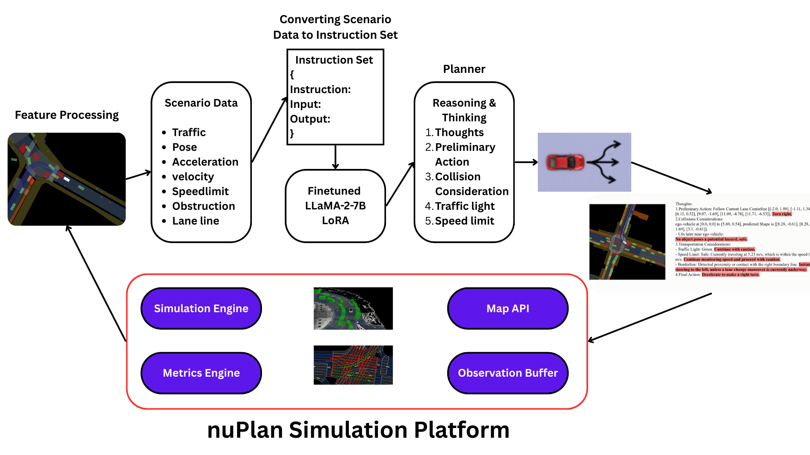
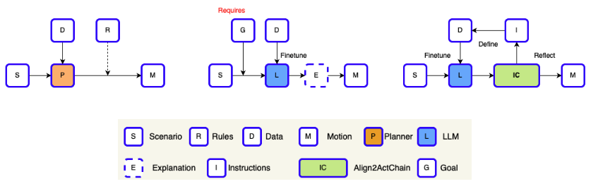
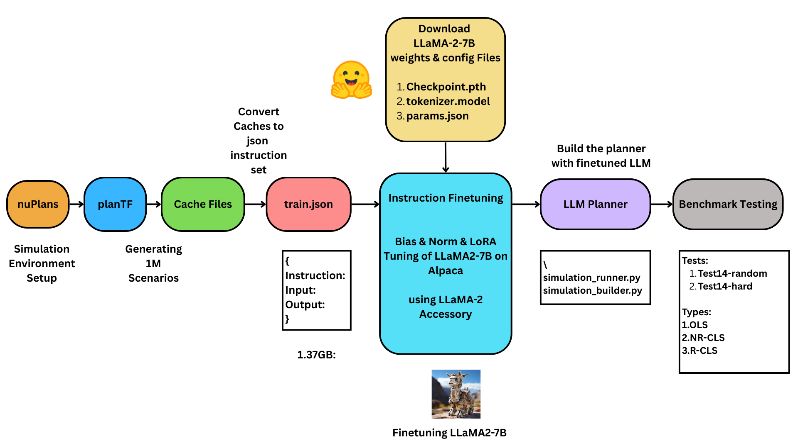
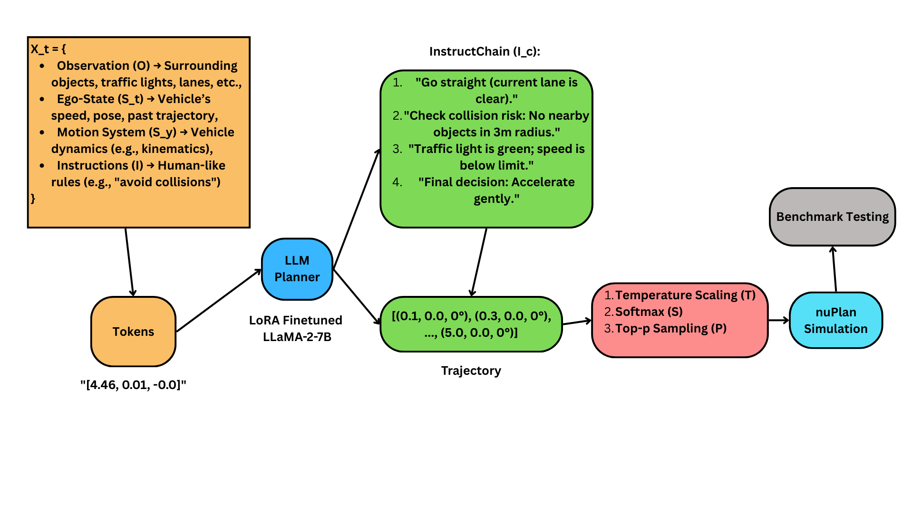

# Align2Act
[](https://www.python.org/)
[](https://pytorch.org/)
[](https://developer.nvidia.com/cuda-zone)
[](https://github.com/motional/nuplan-devkit)
[](https://huggingface.co/meta-llama)
[](https://lightning.ai/)
[](https://huggingface.co/)
[](https://opensource.org/licenses/MIT)


### Instruction-Tuned Models for Human-Aligned Autonomous Driving


## Overview




Our approach transforms scenario data into textual descriptions and, by setting specific instructions, enables a fine-tuned LLM to generate InstructChain and trajectories that align with human driving behavior. The trajectory is subsequently applied in a simulated environment.



## Results

### Test14-random and Test14-hard benchmarks

<table class="tg">
<thead>
  <tr>
    <th class="tg-c3ow" colspan="2">Planners</th>
    <th class="tg-c3ow" colspan="3">Test14-random</th>
    <th class="tg-c3ow" colspan="3">Test14-hard</th>
  </tr>
</thead>
<tbody>
  <tr>
    <td class="tg-0pky">Type</td>
    <td class="tg-0pky">Method</td>
    <td class="tg-c3ow">OLS</td>
    <td class="tg-c3ow">NR-CLS</td>
    <td class="tg-c3ow">R-CLS</td>
    <td class="tg-c3ow">OLS</td>
    <td class="tg-c3ow">NR-CLS</td>
    <td class="tg-c3ow">R-CLS</td>
  </tr>
  <tr>
    <td class="tg-0pky">Expert</td>
    <td class="tg-0pky">LogReplay</td>
    <td class="tg-c3ow">100.0</td>
    <td class="tg-c3ow">94.03</td>
    <td class="tg-c3ow">75.86</td>
    <td class="tg-c3ow">100.0</td>
    <td class="tg-c3ow">85.96</td>
    <td class="tg-c3ow">68.80</td>
  </tr>
  <tr>
    <td class="tg-0pky" rowspan="2">Rule-based</td>
    <td class="tg-0pky">IDM</td>
    <td class="tg-c3ow">34.15</td>
    <td class="tg-c3ow">70.39</td>
    <td class="tg-c3ow">72.42</td>
    <td class="tg-c3ow">20.07</td>
    <td class="tg-c3ow">56.16</td>
    <td class="tg-c3ow">62.26</td>
  </tr>
  <tr>
    <td class="tg-0pky">PDM-Closed</td>
    <td class="tg-c3ow">46.32</td>
    <td class="tg-c3ow">90.05</td>
    <td class="tg-7btt">91.64</td>
    <td class="tg-c3ow">26.43</td>
    <td class="tg-c3ow">65.07</td>
    <td class="tg-c3ow">75.18</td>
  </tr>
  <tr>
    <td class="tg-0pky" rowspan="2">Hybrid</td>
    <td class="tg-0pky">GameFormer</td>
    <td class="tg-c3ow">79.35</td>
    <td class="tg-c3ow">80.80</td>
    <td class="tg-c3ow">79.31</td>
    <td class="tg-c3ow">75.27</td>
    <td class="tg-c3ow">66.59</td>
    <td class="tg-c3ow">68.83</td>
  </tr>
  <tr>
    <td class="tg-0pky">PDM-Hybrid</td>
    <td class="tg-c3ow">82.21</td>
    <td class="tg-7btt">90.20</td>
    <td class="tg-c3ow">91.56</td>
    <td class="tg-c3ow">73.81</td>
    <td class="tg-c3ow">65.95</td>
    <td class="tg-7btt">75.79</td>
  </tr>
  <tr>
    <td class="tg-0pky" rowspan="5">Learning-based<br><br></td>
    <td class="tg-0pky">PlanCNN</td>
    <td class="tg-c3ow">62.93</td>
    <td class="tg-c3ow">69.66</td>
    <td class="tg-c3ow">67.54</td>
    <td class="tg-c3ow">52.4</td>
    <td class="tg-c3ow">49.47</td>
    <td class="tg-c3ow">52.16</td>
  </tr>
  <tr>
    <td class="tg-0pky">UrbanDriver <sup></sup></td>
    <td class="tg-c3ow">82.44</td>
    <td class="tg-c3ow">63.27</td>
    <td class="tg-c3ow">61.02</td>
    <td class="tg-c3ow">76.9</td>
    <td class="tg-c3ow">51.54</td>
    <td class="tg-c3ow">49.07</td>
  </tr>
  <tr>
    <td class="tg-0pky">GC-PGP</td>
    <td class="tg-c3ow">77.33</td>
    <td class="tg-c3ow">55.99</td>
    <td class="tg-c3ow">51.39</td>
    <td class="tg-c3ow">73.78</td>
    <td class="tg-c3ow">43.22</td>
    <td class="tg-c3ow">39.63</td>
  </tr>
  <tr>
    <td class="tg-0pky">PDM-Open</td>
    <td class="tg-c3ow">84.14</td>
    <td class="tg-c3ow">52.80</td>
    <td class="tg-c3ow">57.23</td>
    <td class="tg-c3ow">79.06</td>
    <td class="tg-c3ow">33.51</td>
    <td class="tg-c3ow">35.83</td>
  </tr>
  <tr>
    <td class="tg-0pky">PlanTF </td>
    <td class="tg-7btt">87.07</td>
    <td class="tg-c3ow">86.48</td>
    <td class="tg-c3ow">80.59</td>
    <td class="tg-7btt">83.32</td>
    <td class="tg-7btt">72.68</td>
    <td class="tg-c3ow">61.7</td>
  </tr>
  <tr>
    <td class="tg-0pky" rowspan="2">LLM-based</td>
    <td class="tg-0pky">Align2Act (LLaMA2 without Chain) </td>
    <td class="tg-7btt">61.53</td>
    <td class="tg-c3ow">46.91</td>
    <td class="tg-c3ow">42.47</td>
    <td class="tg-7btt">68.02</td>
    <td class="tg-7btt">55.14</td>
    <td class="tg-c3ow">50.31</td>
  </tr>
  <tr>
    <td class="tg-0pky">Align2Act (InstructionChain) </td>
    <td class="tg-7btt">85.17</td>
    <td class="tg-c3ow">70.31</td>
    <td class="tg-c3ow">66.96</td>
    <td class="tg-7btt">81.12</td>
    <td class="tg-7btt">57.37</td>
    <td class="tg-c3ow">52.95</td>
  </tr>
</tbody>
</table>

## Project Workflow



## Getting Started

### Dataset Setup

Follow the [official documentation](https://nuplan-devkit.readthedocs.io/en/latest/dataset_setup.html) to set up the nuPlan dataset.


### Setup Environment

- Create an environment using Python 3.10

```sh
conda create -n align2act python=3.10
source activate align2act
```

- Follow the [official documentation](https://llama2-accessory.readthedocs.io/en/latest/install.html) to set up the LLaMA2-Accessory environment.
- Follow the [official documentation](https://nuplan-devkit.readthedocs.io/en/latest/installation.html) to set up the nuplan-devkit environment. Make sure to set the following variables correctly:

```
- NUPLAN_DATA_ROOT="/teamspace/studios/this_studio/nuplan-devkit/nuplan/dataset"
- NUPLAN_MAPS="/teamspace/studios/this_studio/nuplan-devkit/nuplan/dataset/maps"
- NUPLAN_EXP_ROOT="/teamspace/studios/this_studio/nuplan-devkit/nuplan/exp" 
```

- Clone the `Align2Act` repository:

```shell
cd nuplan-devkit
git clone https://github.com/Jkanishkha0305/Align2Act.git
```


After setting up the environment, your directory structure should appear as follows:

```
├── LLaMA2-Accessory
├── nuplan-devkit
│  ├── Align2Act
```


### Feature cache

This section preprocesses the dataset to enable faster subsequent data retrieval.

This refers to the implementation of [planTF](https://github.com/jchengai/planTF).

Execute the command below to generate 1M frames of training data in `cache.cache_path`. 

You may need to:

- Modify `cache.cache_path` according to your setup.
- Adjust `worker.threads_per_node` based on your RAM and CPU capacity.

Please note that this step is time-intensive and may take dozens of hours to complete.

```shell
export PYTHONPATH=$(pwd)/nuplan-devkit:$PYTHONPATH
export PYTHONPATH=$(pwd)/nuplan-devkit/Align2Act:$PYTHONPATH

cd ./nuplan-devkit/Align2Act
python run_cache.py \
+caching=cache_llm \
scenario_builder=nuplan \
cache.cache_path=/teamspace/studios/this_studio/cache_1M \
cache.cleanup_cache=true \
scenario_filter=training_scenarios_1M \
worker.threads_per_node=40
```


### Get training data from cache

This section of the code transforms cached data into a json file formatted for training LLM.

Use the command below to process `limit_num` cache entries (modifiable in the code). 

It converts these entries into a json file and saves it at `/teamspace/studios/this_studio/cache_1M/training_json/train.json`:

```shell
cd ./nuplan-devkit/Align2Act
python cache2json.py \
+caching=cache_llm \
cache.cache_path=/teamspace/studios/this_studio/cache_1M
```


### Training

Following the steps outlined above, you will obtain the `train.json` file suitable for training LLM. 

For guidance on fine-tuning the model, please consult the [official documentation](https://llama2-accessory.readthedocs.io/en/latest/finetune/sg_peft.html#bias-norm-lora-tuning-of-llama2-7b-on-alpaca).


### Evaluation

After training, populate the following parameters in the `llm_patches/llm_singleton.py` file:

```python
llama_config='/teamspace/studios/this_studio/LLaMA2-Accessory/accessory/configs/model/finetune/sg/llamaPeft_normBiasLora.json'
lora_config='/teamspace/studios/this_studio/LLaMA2-Accessory/accessory/configs/model/finetune/sg/llamaPeft_normBiasLora.json'
tokenizer_path='/teamspace/studios/this_studio/LLaMA2-Accessory/llama-2-7b/tokenizer.model'
pretrained_path='/teamspace/studios/this_studio/LLaMA2-Accessory/llama-2-7b/pretrained_path'
```

Then, execute the command below to initiate the simulation. You can run various types of simulations by modifying the `simulation_type` parameter:

```shell
export NUPLAN_DATA_ROOT="/teamspace/studios/this_studio/nuplan-devkit/nuplan/dataset"
export NUPLAN_MAPS="/teamspace/studios/this_studio/nuplan-devkit/nuplan/dataset/maps"
export NUPLAN_EXP_ROOT="/teamspace/studios/this_studio/nuplan-devkit/nuplan/exp"     
```


```shell
export PYTHONPATH=$(pwd)/nuplan-devkit:$PYTHONPATH
export PYTHONPATH=$(pwd)/nuplan-devkit/Align2Act:$PYTHONPATH
export PYTHONPATH=$(pwd)/LLaMA2-Accessory:$PYTHONPATH
cd ./nuplan-devkit/Align2Act
simulation_type=open_loop_boxes # closed_loop_nonreactive_agents closed_loop_reactive_agents
sh ./script/benchmarks_test14-hard.sh $simulation_type
```

## Results after Benchmark Tests 
### test14-hard
open_loop_boxes

```python
{   'aggregator_type': 'weighted_average',
    'log_name': None,
    'num_scenarios': 7.0,
    'planner_expert_average_heading_error_within_bound': 0.9490241969626653,
    'planner_expert_average_l2_error_within_bound': 0.3090423109016055,
    'planner_expert_final_heading_error_within_bound': 0.920009529746468,
    'planner_expert_final_l2_error_within_bound': 0.27812476656557045,
    'planner_miss_rate_within_bound': 0.2857142857142857,
    'planner_name': 'Align2Act',
    'scenario': 'final_score',
    'scenario_type': 'final_score',
    'score': 0.2833165956188029
},
```

closed_loop_nonreactive_agents
```python
{   'aggregator_type': 'weighted_average',
    'corners_in_drivable_area': None,
    'drivable_area_compliance': 1.0,
    'driving_direction_compliance': 1.0,
    'ego_is_comfortable': 0.5714285714285714,
    'ego_is_making_progress': 0.2857142857142857,
    'ego_jerk': None,
    'ego_lane_change': None,
    'ego_lat_acceleration': None,
    'ego_lon_acceleration': None,
    'ego_lon_jerk': None,
    'ego_progress_along_expert_route': 0.2903926346289234,
    'ego_yaw_acceleration': None,
    'ego_yaw_rate': None,
    'log_name': None,
    'no_ego_at_fault_collisions': 1.0,
    'num_scenarios': 7.0,
    'planner_name': 'Align2Act',
    'scenario': 'final_score',
    'scenario_type': 'final_score',
    'score': 0.26785709132867425,
    'speed_limit_compliance': 0.9971754001104545,
    'time_to_collision_within_bound': 1.0
},
```

closed_loop_reactive_agents
```python
{   'aggregator_type': 'weighted_average',
    'corners_in_drivable_area': None,
    'drivable_area_compliance': 1.0,
    'driving_direction_compliance': 1.0,
    'ego_is_comfortable': 0.5714285714285714,
    'ego_is_making_progress': 0.2857142857142857,
    'ego_jerk': None,
    'ego_lane_change': None,
    'ego_lat_acceleration': None,
    'ego_lon_acceleration': None,
    'ego_lon_jerk': None,
    'ego_progress_along_expert_route': 0.2903926346289234,
    'ego_yaw_acceleration': None,
    'ego_yaw_rate': None,
    'log_name': None,
    'no_ego_at_fault_collisions': 1.0,
    'num_scenarios': 7.0,
    'planner_name': 'Align2Act',
    'scenario': 'final_score',
    'scenario_type': 'final_score',
    'score': 0.26785709132867425,
    'speed_limit_compliance': 0.9971754001104545,
}
```

## Planner Working



## Visualization


## Acknowledgement

[nuplan-devkit](https://github.com/motional/nuplan-devkit) |  [LLaMA2-Accessory](https://github.com/Alpha-VLLM/LLaMA2-Accessory) | [planTF](https://github.com/jchengai/planTF)

